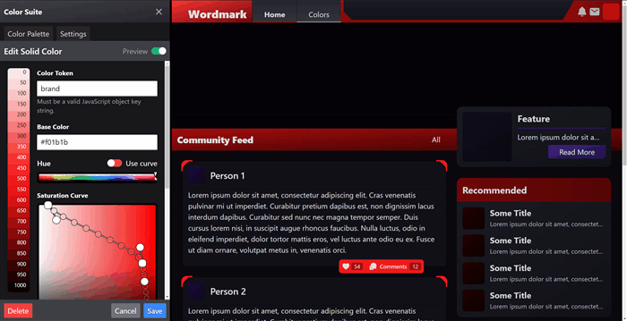

# Color Suite for Tailwind CSS and Vite

An in-browser editor for real time color design of your [Tailwind CSS](https://github.com/tailwindlabs/tailwindcss) and [Vite](https://github.com/vitejs/vite) projects.

**Note:** This is under early active development and may be subject to breaking changes until it reaches a stable version 1.0.0. It is designed so that you may export your work any time should you wish to remove it. Please give it a try if you're interested in this kind of tooling. Suggestions/feedback welcome.

## What is this?



Color Suite is a color design utility that allows you to create a color palette and edit it in real time while working on your web project. It consists of a configurator function for Tailwind CSS that uses Color Suite's color config file, `colors.config.js`, to configure Tailwind's `theme.colors` object; and a Vite plugin that injects a self-contained editor app into your web page during development.

The editor allows you to rapidly design and manage your project's color palette in real time. Included is a color scale tool for building tints and shades from a base color, and a color aliasing tool for dynamically referring to other colors or entire scales in your palette.

Check out the [example project](https://github.com/ShiftLimits/color-suite-playground) to give it a try.

## Installation

Install with your favorite NodeJS package manager:

```bash
$ npm install tailwindcss-color-suite

$ yarn add tailwindcss-color-suite
```

Add the Color Suite plugin to your Vite configuration:

```ts
// vite.config.ts
import { defineConfig } from 'vite'
import { colorSuitePlugin } from 'tailwindcss-color-suite'

export default defineConfig({
  plugins: [
		...
		colorSuitePlugin()
	]
})

```

Finally, use the Color Suite configuration function in your Tailwind CSS config:

```js
// tailwind.config.js
const { tailwindColors } = require('tailwindcss-color-suite')

module.exports = {
	theme: {
		colors: tailwindColors(require('./colors.config.js')),
		...
	}
}
```

## Usage

Start Vite in development mode with `vite dev` and load your project in the browser. There will now be a "Colors" tab anchored to the right side of the window. Clicking this will open the editor for you to begin creating colors. Alternatively you can open and close the panel with `CTRL+SHIFT+F` on the keyboard.

### Creating A Solid Color

Solid colors are a single token name with a single corresponding color value. Simply use the color picker to choose your color.

### Creating A Color Scale

Color scales are created with a curve editor that takes a base color and creates tints and shades from it by giving you curve handles to draw through the HSV color space, sampling at regular intervals along the way. The output is a numeric scale which can be of any range with any number of steps.
#### Steps, Start and End

Color Suite allows you to generate an arbitrary scale of values based on your project's needs. If you're finding that you need more shades than you have, you can edit your scale to increase the number of steps it has.

For instance, by default each scale has 11 steps, starting at 0 and ending at 1000. This creates a scale with tokens for at every 100th up to 1000 including 0. To add tokens for every 50th, you can add 10 additional steps for a total of 21 steps. If you wanted to add tokens for every 25th you could further add another 20 steps for a total of 41 steps.

We adopt Tailwind's approach of having 0 be the lightest part of the scale and 1000 being the darkest. If you prefer it to be the other way around, you can start your scale at 1000 and end at 0 to reverse the order.

#### Use Hue Curve

Enabling this feature will allow you to use the curve editor on the Hue component of your scale.

### Creating A Color Alias

Color aliases allow you to create arbitrary token names that map to existing color values. This helps with creating very specific utility color tokens that point to your carefully designed scales  that update when their target

#### Nested Aliases

Aliases can also refer to other aliases, but make sure references are one-directional. Aliases that end up with cycles (A -> B -> C -> A) will cause the entire chain to display a cyclic reference error and become unavailable until the the cycle is broken.

#### Broken References

If you delete or rename a color that is referred to by an alias it will display an error and become unavailable until reassigned.

## Exporting Your Palette

If you would like to remove Color Suite but keep your palette, you can export the object for pasting in to your Tailwind config. You can use the following command in the same directory as your color config file:

```bash
npx tailwindcss-color-suite export
```

This command will create a file named `tailwind.colors.config.js` containing the exported color object. You can then copy and paste as the value to the `theme.colors` key in your `tailwind.config.js` file.

## Contributing

Thank you for checking out my project. Feedback and suggestions are welcome, please use GitHub issues appropriately.

If you are suggesting any major changes please make sure it is well reasoned and in line with the core principles of this project. Please understand I am one busy person and require a description of the problem and a compelling argument for the proposed solution in order to consider it properly.

## License

Color Suite is [MIT](LICENSE) licensed.